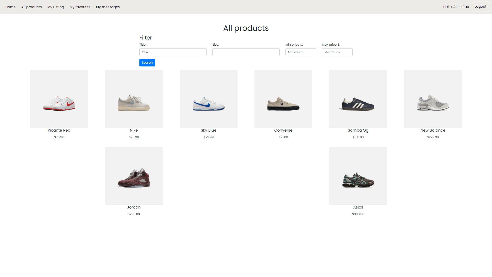
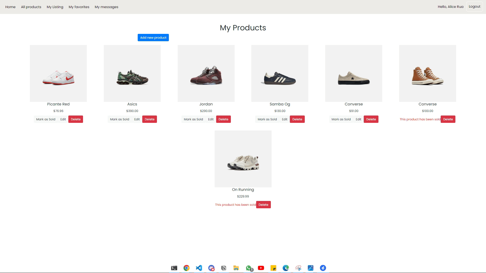

# Footwear Fusion

Footwear Fusion is a marketplace for shoe enthusiasts, operating as a simplified Kijiji clone where users can buy and sell various types of footwear. The full-stack app is built with server-side JavaScript (NodeJS, Express), utilizes PostgreSQL for database management, and employs jQuery and CSS preprocessors for a seamless UI/UX.

## Getting Started

1. Install dependencies using the npm install command.
2. Start the web server using the npm run local command. The app will be served at http://localhost:8080/.
3. Go to http://localhost:8080/ in your browser.

## Core Features

- Once registered and logged in, check out the list of all products to view the various selecion of footwear. In this page you can browse the different shoes and use the filter to view the different options available.

- When selecting the image of interest, you can mark as favorite and send messages to the seller.

- The "My Listing" page will show the sellers items. Here you can, mark as sold, edit or delete a post created by the seller. You can also add new products that will be posted for buyers to see.

## Screenshots

**View All Features**

**View How To Favorite and Send Messages**

**Pages to Show Seller's Products to Edit, Add and Mark Products as Sold**

## Dependencies

- Node 10.x or above
- NPM 5.x or above
- PG 6.x
- BCRYPT 5.1.1 or above
- CHALK 2.4.2 or above
- COOKIE-SESSION 2.0.0 or above
- DOTENV 2.0.0 or above
- EJS 2.6.2 or above
- EXPRESS 4.17.1 or above
- MORGAN 1.9.1 or above

## Conclusion

Thank you for checking out our Footwear Fusion Buy/Sell Website!
